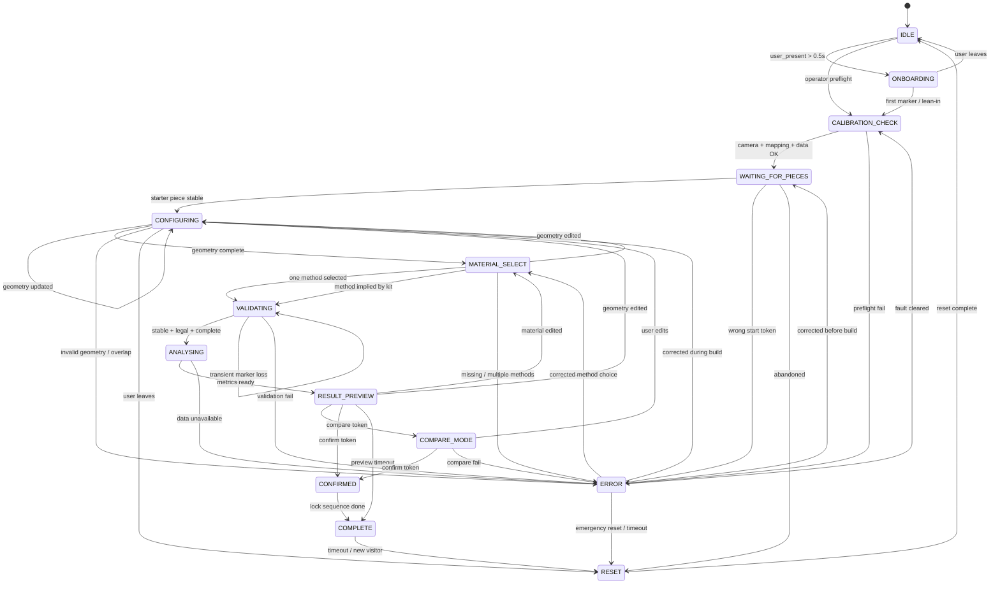

# TouchDesigner FSM Proposal

**Project:** Hardware III - Comparative Construction Decision Exhibit  
**Prepared:** May 4, 2026  
**Runtime decision:** Rhino remains the geometry and fabrication authoring tool; TouchDesigner becomes the central runtime for FSM logic, vision intake, projection output, debugging, and demo control.  

This document supersedes the older runtime assumption in [README.md](/o:/Hardware_III/README.md) and the existing planning notes that still mention `Grasshopper + Anemone` as the live FSM environment.

## 1. Project Interpretation

### Project in 1 sentence
This project is an interactive construction-decision exhibit in which people physically configure a small building scenario with tagged pieces and immediately see the environmental, labor, time, and economic consequences of that configuration through projection.

### Interaction logic in 1 sentence
The system watches for presence, guides the next physical action, validates whether the placed pieces form a legal configuration, then locks and reveals a comparison result before allowing the next decision.

### Why this is an FSM problem, not only a mapping problem
- A pure mapping system only says "current marker position = current output."
- This exhibit must remember where the interaction is in time: waiting, guiding, validating, recovering, analysing, confirming, comparing, and resetting.
- The output must change not only because values change, but because the meaning of the same input changes by state.
- Wrong placement, incomplete selection, missing data, sensor dropouts, and user abandonment all require different recovery paths.
- The course requirement is explicitly state-based human-in-the-loop interaction, not continuous reactive graphics.

### Design assumptions taken from the repo and current brief
- Primary output is the projected table surface; an auxiliary screen is optional, not required.
- The project should remain prototype-realistic for this term: 1 geometry family, 2-3 construction methods, 5-8 physical pieces per scenario, and a small set of control tokens.
- ArUco-tagged pieces are the preferred tracking strategy because projector light makes color tracking fragile.
- The next course session after this document is **May 11, 2026**, so the immediate goal is a reduced but real TouchDesigner prototype, not a full final installation.

## 2. FSM State List

Recommended top-level FSM states:

`IDLE`, `ONBOARDING`, `CALIBRATION_CHECK`, `WAITING_FOR_PIECES`, `CONFIGURING`, `MATERIAL_SELECT`, `VALIDATING`, `ANALYSING`, `RESULT_PREVIEW`, `COMPARE_MODE`, `CONFIRMED`, `COMPLETE`, `ERROR`, `RESET`

### State definitions

| State | Purpose | Entry condition | Inputs listened to | Outputs shown | Allowed transitions | Timeout / fallback | Owner / support |
|---|---|---|---|---|---|---|---|
| `IDLE` | Low-energy attract state; waits for a visitor and keeps the system legible from afar. | Power on complete, or reset finished and table cleared. | `user_present`, `proximity_value`, reference marker health, manual override. | Dim industrial grid, one-line prompt, slow ambient pulse, optional idle sound bed. | `ONBOARDING`, `CALIBRATION_CHECK` for operator-only preflight, `RESET`. | Stay here indefinitely; if sensors are unhealthy, raise operator-only warning without leaving idle. | System Architecture Lead, TD FSM Owner, Visuals Owner |
| `ONBOARDING` | Explains the interaction in under 3 seconds and establishes that the user is collaborating with the system. | `user_present == true` for debounce window. | `user_present`, `marker_detected`, proximity, manual override. | "Place a piece in the highlighted zone" message, starter zone outline, short attention cue. | `CALIBRATION_CHECK`, `IDLE`, `RESET`. | If user leaves before starting, return to `IDLE` after 5-8 s. | System Architecture Lead, Visuals Owner, Sensor/Sound/QA Owner |
| `CALIBRATION_CHECK` | Confirms camera, projector mapping, reference markers, and data tables are ready before the session actually advances. | First interaction begins, operator requests preflight, or system fault is recovering. | Camera health, sensor health, reference markers, data-table availability, manual override. | Cyan/white diagnostics overlay, table boundary outline, operator messages only if fault exists. | `WAITING_FOR_PIECES`, `ERROR`, `RESET`. | If preflight cannot pass within 10 s, enter `ERROR`. | Integration Lead, TD FSM Owner, CV Owner, Projection Owner |
| `WAITING_FOR_PIECES` | Awaits the first valid geometry piece or starter token. | Calibration passes and session opens. | Marker list, piece IDs, piece types, zone occupancy, user presence. | Start zone highlight, allowed zones, optional ghost of first legal piece. | `CONFIGURING`, `ERROR`, `IDLE`, `RESET`. | If user leaves for 15-20 s with no committed action, enter `RESET`. | TD FSM Owner, CV Owner, Rhino/Fabrication Owner |
| `CONFIGURING` | Main assembly/configuration phase; user places, moves, or removes geometry pieces. | At least one valid geometry piece is stably detected in build zone. | Full marker packet, piece transforms, zone tests, overlap tests, stability, presence, manual override. | Active target guide, currently valid footprint, occupied zones, partial metrics, next-action hint. | `CONFIGURING`, `MATERIAL_SELECT`, `ERROR`, `RESET`. | If tracking is noisy, hold last good configuration up to 500 ms; if user walks away >20 s, go to `RESET`. | TD FSM Owner, CV Owner, Projection Owner, Rhino/Fabrication Owner |
| `MATERIAL_SELECT` | Waits for a construction-method or material token after geometry is complete enough to evaluate. | Required geometry pieces are present and stable. | Material token markers, program token markers, selected method zone, manual override. | Dedicated selection zone lights up; method labels, hatch patterns, or neutral material icons appear. | `VALIDATING`, `CONFIGURING`, `ERROR`, `RESET`. | If method is implied by the kit, auto-skip to `VALIDATING`; if nothing selected for 10 s, pulse prompt and stay here. | TD FSM Owner, Data/Narrative Owner, CV Owner, Projection Owner |
| `VALIDATING` | Freezes the current snapshot briefly and checks if the configuration is legal, complete, and trustworthy enough to analyse. | Geometry and material selection are stable long enough to test. | Stability windows, confidence values, zone membership, geometry rules, required fields, data availability, manual override. | Amber hold state, "checking configuration" text, freeze frame of current guides. | `ANALYSING`, `ERROR`, `CONFIGURING`, `RESET`. | Use a 250-500 ms grace window for temporary marker loss before failing. | TD FSM Owner, CV Owner, Integration Lead |
| `ANALYSING` | Computes the metrics for the current configuration and builds the comparison payload. | Validation passes. | Data tables, selected method, piece list, area/shape result, manual override. | Blueprint-like scan pass, loading bar no longer than 1-2 s, restrained metric placeholders. | `RESULT_PREVIEW`, `ERROR`, `RESET`. | If data table lookup fails or times out, enter `ERROR`; never hang silently. | TD FSM Owner, Data/Narrative Owner, Integration Lead |
| `RESULT_PREVIEW` | Shows the first full outcome and invites either editing, comparison, or confirmation. | Analysis finishes successfully. | Marker changes, compare token, confirm token, proximity, manual override. | Cost, CO2, labor, time, revenue/profit summary; clear "edit / compare / confirm" options. | `CONFIGURING`, `MATERIAL_SELECT`, `COMPARE_MODE`, `CONFIRMED`, `RESET`. | If no input for 20 s, drift to `COMPLETE` or `RESET` depending on exhibition mode. | TD FSM Owner, Visuals Owner, Data/Narrative Owner |
| `COMPARE_MODE` | Displays side-by-side or layered comparison between the current scenario and alternate methods/options. | Compare token placed, compare button pressed, or auto-compare requested after preview. | Current config snapshot, comparison mode selection, material/program tokens, manual override. | Split-screen projection on the table, delta values, ranges with source labels, ranked trade-offs. | `CONFIGURING`, `MATERIAL_SELECT`, `CONFIRMED`, `RESET`, `ERROR`. | If user edits geometry or material, leave compare mode immediately and return to the relevant edit state. | TD FSM Owner, Visuals Owner, Data/Narrative Owner |
| `CONFIRMED` | Latches the chosen scenario, records the result, and triggers the short closing sequence. | User explicitly confirms via token, hold gesture, or operator command. | Confirm token, manual override, logging system. | Green confirmation band, locked metrics, short resolved sound, archival log write. | `COMPLETE`, `RESET`. | Auto-advance to `COMPLETE` after 1-2 s. | TD FSM Owner, Sensor/Sound/QA Owner, Integration Lead |
| `COMPLETE` | Final state for the active session; shows the completed comparison and invites a new participant. | Confirmation sequence finishes, or preview idles into exhibition summary mode. | Presence, reset, manual override. | Final neutral comparison composition, headline finding, "clear table for next session" or "new visitor start" prompt. | `RESET`, `IDLE`. | After 15-30 s, if table is clear, proceed to `RESET` then `IDLE`. | Visuals Owner, TD FSM Owner, Sensor/Sound/QA Owner |
| `ERROR` | Centralized recovery state for invalid placement, bad tracking, overlapping pieces, missing data, or hardware faults. | Any state raises a non-ignorable error condition. | Error code, offending piece, last good config, manual override, reset, corrected marker packet. | Red oxide warning, ghost target, concise fix instruction, operator-only diagnostics in debug panel. | `WAITING_FOR_PIECES`, `CONFIGURING`, `MATERIAL_SELECT`, `CALIBRATION_CHECK`, `RESET`. | If corrected within a short window, return to the previous safe state; if fault persists >30 s, require operator reset. | TD FSM Owner, CV Owner, Projection Owner, QA/Ops Owner |
| `RESET` | Clears active session data in a controlled way and returns the table to a known state. | Timeout, abandonment, complete sequence end, emergency reset, or operator command. | Reset signal, table clear check, user presence, manual override. | Fade out guides, clear overlays, restore idle grid, operator confirmation if pieces remain on table. | `IDLE`, `CALIBRATION_CHECK`. | If pieces are still present, hold reset until table clears or operator forces demo reset. | TD FSM Owner, QA/Ops Owner, Integration Lead |

## 3. Transition Table

Use the following rule format in TouchDesigner tables and documentation:  
`IF [condition] THEN [action] ENTER [STATE]`

| Current State | Trigger / Event | Condition | Next State | Action on transition | Visual feedback | Notes / edge cases |
|---|---|---|---|---|---|---|
| `IDLE` | Presence detected | IF `user_present == true` for `>= 500 ms` THEN open session | `ONBOARDING` | Clear stale session data, start onboarding timer | Idle grid brightens; starter zone appears | Ignore fast walk-bys shorter than debounce |
| `IDLE` | Operator preflight | IF `manual_override == preflight` THEN run system check | `CALIBRATION_CHECK` | Load reference markers and health probes | Cyan diagnostics layer | Use before demos begin |
| `ONBOARDING` | First interaction | IF `marker_detected == true` OR `proximity_value > engage_threshold` THEN lock visitor session | `CALIBRATION_CHECK` | Stamp `session_id`, reset timers | Intro text collapses into guide outline | Keeps onboarding short |
| `ONBOARDING` | Visitor leaves | IF `user_present == false` for `>= 5 s` THEN abandon session | `IDLE` | Clear onboarding timer | Fade back to idle | No log needed unless repeated |
| `CALIBRATION_CHECK` | Preflight pass | IF `camera_online AND projector_map_ok AND reference_markers_ok AND data_tables_ok` THEN arm build loop | `WAITING_FOR_PIECES` | Set `previous_safe_state = WAITING_FOR_PIECES` | Table boundary and first target zone turn white/yellow | Recommended every new session |
| `CALIBRATION_CHECK` | Preflight fail | IF any required subsystem is false for `>= 1 s` THEN raise calibration fault | `ERROR` | Set `error_code = CALIBRATION_FAIL` | Cyan becomes red; operator fault text | Fault can be CV, mapping, or data |
| `WAITING_FOR_PIECES` | Starter piece placed | IF a valid geometry piece is `stable == true` inside a legal start zone THEN accept it | `CONFIGURING` | Create active configuration snapshot | First footprint fills, next zone highlighted | One-piece threshold keeps entry simple |
| `WAITING_FOR_PIECES` | Wrong token first | IF only material/control tokens appear without geometry THEN reject | `ERROR` | Set `error_code = WRONG_START_TOKEN` | Red outline on selection zone | Optional; can also simply ignore |
| `WAITING_FOR_PIECES` | Session abandoned | IF `user_present == false` for `>= 15 s` AND no committed pieces exist THEN clear session | `RESET` | Log `abandoned_before_start` | Guides fade out | Return to clean table state |
| `CONFIGURING` | Geometry update | IF any geometry piece is added, moved, or removed and becomes stable THEN refresh live config | `CONFIGURING` | Recompute legal footprint and partial metrics | Live guides update without state change | Self-transition is valid here |
| `CONFIGURING` | Geometry complete | IF required geometry rule set passes AND no overlaps exist THEN request method choice | `MATERIAL_SELECT` | Freeze current geometry snapshot | Material selection zone lights up | "Complete enough" can mean minimum viable building |
| `CONFIGURING` | Invalid placement | IF piece overlaps another, leaves allowed zone, or illegal adjacency is detected THEN stop forward flow | `ERROR` | Set `error_code = INVALID_GEOMETRY` and store offending piece | Red hatch + ghost correction | Keep last good config in memory |
| `CONFIGURING` | User leaves mid-build | IF `user_present == false` for `>= 20 s` THEN pause then reset | `RESET` | Log `abandoned_mid_configuration` | Projection dims before clearing | Could be longer during testing |
| `MATERIAL_SELECT` | Method implied by kit | IF the placed kit already encodes method/material THEN auto-populate selection | `VALIDATING` | Set `selected_material` from piece metadata | Prompt changes to amber hold | Use this to simplify early prototype |
| `MATERIAL_SELECT` | One material selected | IF exactly one valid material token is stable in the selection zone THEN lock choice | `VALIDATING` | Store `selected_material` and `selected_program` if present | Selection zone becomes amber | The cleanest explicit control pattern |
| `MATERIAL_SELECT` | Selection edited | IF geometry piece changes while in this state THEN resume building | `CONFIGURING` | Clear selection latch | Material overlay disappears | Prevents stale material choice |
| `MATERIAL_SELECT` | No or multiple materials | IF no material is selected when confirm requested OR more than one token is stable THEN reject | `ERROR` | Set `error_code = MATERIAL_SELECTION_INVALID` | Red message: "select one method" | Better than silently picking one |
| `VALIDATING` | Validation pass | IF all required markers are stable, confidence is above threshold, geometry is legal, and data exists THEN commit snapshot | `ANALYSING` | Freeze config, start analysis timer | Amber hold resolves into scan sweep | This is the critical "gate" state |
| `VALIDATING` | Transient marker loss | IF active marker disappears for `< 500 ms` THEN keep waiting | `VALIDATING` | Hold last good pose | Amber "hold still" flash | Do not punish brief occlusion |
| `VALIDATING` | Validation fail | IF missing piece, missing material, low confidence beyond grace, or illegal geometry is detected THEN recover | `ERROR` | Set precise `error_code` | Red correction overlay | Error reason must be loggable |
| `ANALYSING` | Data ready | IF metric computation and lookup complete successfully THEN publish results | `RESULT_PREVIEW` | Write full metrics payload | Blueprint scan reveals metric cards | Keep this fast and deterministic |
| `ANALYSING` | Data problem | IF data key missing, CSV unreadable, or compute exception occurs THEN fail visibly | `ERROR` | Set `error_code = DATA_UNAVAILABLE` | Warning text replaces loading animation | Never show fake numbers silently |
| `RESULT_PREVIEW` | Edit geometry | IF any geometry piece changes and becomes stable THEN unlock result | `CONFIGURING` | Clear result lock and compare cache | Result cards collapse into guides | Most natural way to keep agency |
| `RESULT_PREVIEW` | Edit material | IF material token changes or is removed THEN unlock selection | `MATERIAL_SELECT` | Clear selected method and deltas | Material zone relights | Separate from geometry edit |
| `RESULT_PREVIEW` | Compare request | IF compare token is stable for `>= 500 ms` OR compare button pressed THEN open comparison | `COMPARE_MODE` | Build delta tables and alternate scenarios | Split comparison view appears | Compare can be token or UI button |
| `RESULT_PREVIEW` | Confirm request | IF confirm token is stable for `>= 1000 ms` OR operator confirms THEN lock result | `CONFIRMED` | Persist current scenario and log event | Green band and resolved cue | Explicit confirmation avoids accidental commit |
| `COMPARE_MODE` | Comparison accepted | IF confirm token is stable for `>= 1000 ms` THEN accept displayed choice | `CONFIRMED` | Persist chosen comparison state | Comparison view resolves to locked result | Use same confirm control as preview |
| `COMPARE_MODE` | User resumes editing | IF geometry or material changes THEN leave compare immediately | `CONFIGURING` | Clear compare cache | Comparison layer slides away | Keeps compare mode read-only |
| `COMPARE_MODE` | Comparison fault | IF alternate data cannot be generated THEN recover | `ERROR` | Set `error_code = COMPARE_FAIL` | Warning text on affected panel | Rare but should be handled |
| `CONFIRMED` | Confirm sequence done | IF confirmation timer finishes THEN show final session output | `COMPLETE` | Mark session as finished | Green resolves to neutral summary | Usually 1-2 s |
| `COMPLETE` | Session timeout | IF no interaction occurs for `>= 15 s` THEN begin cleanup | `RESET` | Log `session_complete_timeout` | Final summary fades down | Use longer timeout for public display |
| `COMPLETE` | New visitor interacts early | IF table is clear AND `user_present == true` THEN restart quickly | `RESET` | Fast cleanup | Summary dims, reset pulse | Feels responsive |
| `ERROR` | Recoverable correction | IF offending condition clears AND subsystem health is good THEN return to stored safe state | `CONFIGURING` or `WAITING_FOR_PIECES` or `MATERIAL_SELECT` | Restore last good snapshot | Red clears back to previous guide | Return target depends on `previous_safe_state` |
| `ERROR` | System fault corrected | IF calibration fault clears after operator action THEN rerun preflight | `CALIBRATION_CHECK` | Clear error latch | Cyan diagnostics return | Better than jumping straight back into build |
| `ERROR` | Emergency reset | IF `reset_signal == true` OR operator presses reset THEN abort session | `RESET` | Clear volatile state and log error reset | Red fades to black then idle grid | Must work from any state |
| `RESET` | Reset complete | IF table is clear OR operator forces reset THEN re-arm attract loop | `IDLE` | Flush session store, clear overlays | Idle grid returns | This should always be deterministic |

## 4. Input Contract

### Recommended architecture
Do not let the FSM read raw camera nodes directly. Normalize all CV and sensor data into one structured packet, then let the FSM consume only that packet.

Recommended contract shape:

```json
{
  "timestamp": 1777858800123,
  "camera_online": true,
  "sensor_online": true,
  "data_tables_ok": true,
  "projector_map_ok": true,
  "user_present": true,
  "proximity_value": 0.72,
  "marker_detected": true,
  "marker_count": 3,
  "markers": [
    {
      "piece_id": "WALL_A_01",
      "piece_type": "geometry",
      "x": 0.412,
      "y": 0.638,
      "rotation": 91.4,
      "confidence": 0.93,
      "is_stable": true,
      "is_inside_zone": true,
      "zone_id": "build_zone_01",
      "selected_material": null,
      "selected_program": null
    },
    {
      "piece_id": "TOKEN_CLT",
      "piece_type": "material_token",
      "x": 0.822,
      "y": 0.214,
      "rotation": 0.0,
      "confidence": 0.96,
      "is_stable": true,
      "is_inside_zone": true,
      "zone_id": "material_zone"
    }
  ],
  "manual_override": false,
  "reset_signal": false
}
```

### Required fields

| Field | Type | Notes |
|---|---|---|
| `timestamp` | integer or ISO string | Use Unix ms if possible for easier delta timing. |
| `user_present` | bool | Derived from proximity sensor, CV occupancy, or both. |
| `proximity_value` | float | Normalized `0.0-1.0` or documented sensor units. |
| `marker_detected` | bool | True when at least one marker passes minimum confidence. |
| `marker_count` | int | Count of currently valid markers. |
| `piece_id` | string | Unique per physical piece or control token. |
| `piece_type` | enum | Example: `geometry`, `material_token`, `program_token`, `confirm_token`, `compare_token`, `reset_token`, `debug_token`. |
| `x`, `y` | float | Normalized table coordinates `0.0-1.0`; convert once at the CV layer. |
| `rotation` | float | Degrees in table plane. |
| `confidence` | float | Normalized `0.0-1.0`. |
| `is_stable` | bool | Computed upstream from several frames, not guessed by the FSM each frame. |
| `is_inside_zone` | bool | Zone test against the current calibrated table polygon. |
| `selected_material` | string or null | Usually filled only for material tokens or derived piece metadata. |
| `selected_program` | string or null | Optional, if the exhibit includes program/usage choices. |
| `manual_override` | bool or enum | Can be simple bool for prototype, enum later for `preflight`, `force_confirm`, `manual_demo`. |
| `reset_signal` | bool | Triggerable by operator button, token, or keyboard shortcut. |

### Recommended update rates

| Source | Recommended rate | Minimum acceptable |
|---|---|---|
| Webcam / ArUco detection | 20-30 Hz | 15 Hz |
| Proximity / ESP32 sensor | 10-20 Hz | 5 Hz |
| FSM evaluation tick in TouchDesigner | 30 Hz | 20 Hz |
| Projection output | 30 or 60 FPS | 30 FPS |

### Confidence and stability thresholds

| Check | Recommended value |
|---|---|
| Marker accepted as detected | `confidence >= 0.75` |
| Marker accepted as usable for state transitions | `confidence >= 0.85` |
| Stable placement window | `250-300 ms` of low movement |
| Maximum drift during stability window | `<= 10-15 mm` equivalent and `<= 8 deg` rotation |
| Temporary loss grace period | `<= 500 ms` before failure |
| Presence debounce | `500 ms` |
| Confirm token hold | `1000 ms` |

### Noisy or missing input behavior

- If a marker briefly disappears, keep the last good pose for up to `500 ms` and remain in the current state.
- If confidence oscillates near threshold, do not state-switch on every frame; require stability over time.
- If `sensor_online == false`, fall back to CV-based occupancy for `user_present` and log a warning.
- If `camera_online == false`, the system cannot validate configuration; go to `ERROR` or operator-driven manual demo mode.
- If required fields are missing in the packet, discard that packet, log `BAD_INPUT_PACKET`, and keep the previous good state.
- If two markers claim the same physical zone, the CV layer should flag overlap explicitly; the FSM should not try to infer intent.

## 5. Output Contract

The FSM should publish one normalized output payload per tick, even if some consumers only use part of it.

### Shared output fields

| Field | Type | Consumer | Purpose |
|---|---|---|---|
| `current_state` | string | All | Authoritative runtime state |
| `previous_state` | string | Debug/logging | Recovery and inspection |
| `state_entered_at` | integer | Debug/logging | Timing, timeout handling |
| `active_piece_id` | string or null | Projection, debug | Piece currently being guided or corrected |
| `valid_zone_geometry` | polygon / table row / JSON | Projection | Current legal placement region(s) |
| `projected_guides` | JSON object | Projection | Active outlines, arrows, ghost transforms, labels |
| `state_color` | string / RGB tuple | Projection, UI | State-specific palette token |
| `warning_message` | string or null | Projection, debug | User-facing or operator-facing warning |
| `instruction_text` | string | Projection | Main message for the visitor |
| `cost_estimate` | float or range | Data viz | Cost output |
| `co2_estimate` | float or range | Data viz | Environmental output |
| `labor_hours` | float or range | Data viz | Labor output |
| `construction_time` | float or range | Data viz | Time output |
| `revenue_estimate` | float or range | Data viz | Optional business output |
| `profit_estimate` | float or range | Data viz | Optional business output |
| `comparison_mode` | string / bool | Data viz, projection | Current comparison view mode |
| `confidence_display` | float | Debug, operator overlay | Current trust level |
| `sound_cue` | string or null | Sound system | Which cue to play |
| `sound_gain` | float | Sound system | Intensity or mix level |
| `esp32_feedback` | string or null | ESP32 / external hardware | Optional light or haptic trigger |
| `log_event` | string | Logging | Event line to append |

### Per-subsystem expectations

#### Projection mapping system
- Receives `current_state`, `projected_guides`, `valid_zone_geometry`, `state_color`, `instruction_text`, `warning_message`.
- Must render the active target, the active correction, and the active comparison layout without needing to know business logic.
- Should treat the FSM as the only authority for whether an outline is a target, a warning, or a locked result.

#### Data visualization system
- Receives `cost_estimate`, `co2_estimate`, `labor_hours`, `construction_time`, `revenue_estimate`, `profit_estimate`, `comparison_mode`, plus source labels if available.
- Can be rendered on the same projector surface or an auxiliary screen.
- Must support ranges, not only single values, because the repo critique explicitly notes contested numbers.

#### Sound / ESP32 system
- Receives `sound_cue`, `sound_gain`, and optional `esp32_feedback`.
- Example cues: `idle_hum`, `engage_ping`, `validate_hold`, `confirm_resolve`, `error_buzz`, `complete_ambient`.
- The sound layer should reinforce state changes, not narrate them.

#### Debug / logging system
- Receives all state fields plus `log_event`, subsystem health flags, error codes, and raw confidence.
- Should append timestamped rows to a `logging DAT` and optionally to disk.
- Must be operator-readable during setup and demo-day troubleshooting.

## 6. State Outputs / Visual Design

### Visual language
- Use an industrial palette: graphite background, white linework, safety yellow for guidance, cyan for diagnostics, green for confirmed, red oxide for error.
- Use terse language: one short verb phrase per state.
- Use technical typography: DIN-style condensed or mono numerics, not playful UI graphics.
- Use motion as fabrication logic: scanlines, wipes, contour fills, and lock bands, not game-like explosions.

### State-by-state output design

| State | Projection color | Text / message | Geometry overlay | Data overlay | Sound cue | Active surface |
|---|---|---|---|---|---|---|
| `IDLE` | Dark graphite + dim white | `STEP IN TO CONFIGURE` | Faint table frame only | None | Low industrial hum | Table active, side screen optional off |
| `ONBOARDING` | White + safety yellow | `PLACE A PIECE IN THE LIT ZONE` | One start zone outline and arrow | None | Short engage ping | Table active |
| `CALIBRATION_CHECK` | Cyan + white | `CHECKING ALIGNMENT` | Table boundary, reference corner marks | Tiny operator-only diagnostics | Soft calibration tick | Table active, debug panel active |
| `WAITING_FOR_PIECES` | White + yellow | `START WITH STRUCTURE` | First legal footprint ghosted | Optional labels for piece families | Light pulse | Table active |
| `CONFIGURING` | White + yellow with blue-gray support lines | `BUILD THE SCENARIO` | Occupied zones solid, next zone outlined, invalid edge hatching if needed | Partial totals in small corner band | Subtle placement tick | Table active |
| `MATERIAL_SELECT` | Yellow + neutral material hatches | `SELECT CONSTRUCTION METHOD` | Geometry remains dimly locked | Method labels, origin hint, maybe one-source tag | Soft selector click | Table active, optional side strip |
| `VALIDATING` | Amber hold state | `HOLD STILL` / `CHECKING` | Freeze current geometry, pulse outline | Data hidden until pass | Short hold tone | Table active |
| `ANALYSING` | White + cyan scan | `CALCULATING IMPACT` | Geometry becomes a blueprint silhouette | Metric placeholders only | Low scan tone | Table active |
| `RESULT_PREVIEW` | White + green accents | `EDIT / COMPARE / CONFIRM` | Final footprint locked | Main metrics visible: CO2, labor, time, cost, revenue/profit | Quiet resolved tone | Table active, optional side screen active |
| `COMPARE_MODE` | Neutral white + method accent bands | `COMPARE METHODS` | Current geometry centered; alternates arranged side by side | Delta bars, ranges, sources, trade-off labels | Layered ambient comparison sound | Table + side screen if available |
| `CONFIRMED` | Green band | `SCENARIO LOCKED` | Locked footprint glows briefly | Final selected metrics fixed | Confirmation chime | Table active |
| `COMPLETE` | Neutral white with restrained highlights | `CLEAR TABLE FOR NEXT DECISION` or headline finding | Full final comparison layout | Final comparison summary | Slow ambient resolve | Table active, side screen optional |
| `ERROR` | Red oxide + white ghost | `ADJUST PIECE` / `SELECT ONE METHOD` / `TRACKING LOST` | Offending zone outlined in red; correct pose ghosted | No new metrics; only warning | Error buzz or muted click | Table active, debug panel active |
| `RESET` | Fade to graphite | `RESETTING SESSION` | Guides fade out | Data clears | Soft down-sweep | Table active |

The user should be able to infer the three core meanings without explanation:
- Yellow/white means "do something here."
- Amber means "wait, the system is checking."
- Green means "accepted."
- Red means "fix this."

## 7. TouchDesigner Implementation Strategy

### Recommended network structure

```text
/project1
  /io
    /cv_in
    /sensor_in
    /manual_controls
  /data
    states_def
    transitions_def
    pieces_def
    zones_def
    methods_def
    metrics_db
  /fsm
    fsm_core
    fsm_events
    state_store
    event_log
    idle_timer
    stability_timer
    confirm_timer
    error_grace_timer
  /analysis
    config_solver
    metrics_out
  /viz
    guides_top
    overlays_top
    compare_top
    mapping_out
  /audio
    cue_router
  /debug
    operator_panel
    live_input_table
    live_state_table
```

### Base COMP responsibilities

| COMP / operator group | Role |
|---|---|
| `/io/cv_in` | Ingest webcam / ArUco results, or receive them over OSC / WebSocket if CV runs externally. Normalize to one packet schema. |
| `/io/sensor_in` | Read ESP32 proximity via Serial DAT, OSC, or WebSocket. Normalize to `user_present` and `proximity_value`. |
| `/io/manual_controls` | Panel COMP with buttons: `preflight`, `force_confirm`, `manual_demo`, `reset`, `next_state`, `previous_state`. |
| `/data/states_def` | Table DAT with state names, timeout values, palette tokens, and allowed next states. |
| `/data/transitions_def` | Table DAT with explicit `current_state`, `event_name`, `condition_key`, `next_state`, `action_name`. |
| `/data/pieces_def` | Table DAT defining piece IDs, piece types, expected zones, required order, and legal adjacency. |
| `/data/zones_def` | Table DAT of calibrated polygons or normalized bounding boxes. |
| `/data/methods_def` | Table DAT for material / method tokens, source labels, narrative text. |
| `/data/metrics_db` | DAT or external CSV with cost, CO2, labor, time, origin, revenue/profit ranges. |
| `/fsm/fsm_core` | Base COMP with extension class storing current state, previous state, timers, last good snapshot, error code. |
| `/fsm/fsm_events` | Execute DAT or DAT-to-Python router that translates incoming packets into discrete events. |
| `/analysis/config_solver` | Python DAT that converts active piece set into area, shape, method, and lookup keys. |
| `/viz/*` | TOP networks for guides, data overlays, and projector mapping. They should render based on FSM output tables, not re-implement logic. |
| `/debug/operator_panel` | Container COMP showing current state, timers, subsystem health, error code, and manual buttons. |
| `/fsm/event_log` | Table DAT appending timestamped transition records; optionally mirror to disk. |

### CHOPs, TOPs, and DATs

| Type | Recommended use |
|---|---|
| `TOPs` | Camera frames, thresholding, projection layers, masks, mapping output |
| `CHOPs` | Proximity values, timers, debounced booleans, state pulse triggers, sound cue routing |
| `DATs` | State tables, transition tables, piece rules, logs, JSON packets, Python logic |

### Timer CHOP usage

| Timer | Purpose | Typical duration |
|---|---|---|
| `idle_timer` | Return from onboarding or complete to idle/reset | 5-30 s |
| `stability_timer` | Confirm a marker is stable before changing state | 250-300 ms |
| `confirm_timer` | Avoid accidental confirm | 1000 ms |
| `error_grace_timer` | Allow brief CV dropout without erroring | 300-500 ms |
| `analysis_timer` | Bound calculation time | 1000-2000 ms |

### Transport options

- If CV lives inside TouchDesigner: use OpenCV TOP or Python/OpenCV inside `/io/cv_in`, then publish a normalized DAT/CHOP packet.
- If CV lives outside TouchDesigner: prefer `OSC` or `WebSocket` carrying JSON.
- If ESP32 is separate: prefer `Serial DAT` for first prototype, `OSC` over Wi-Fi only if stable in the exhibition room.

### Debug panel must show
- `current_state`
- `previous_state`
- `last_event`
- `active_piece_id`
- `selected_material`
- `marker_count`
- average confidence
- `camera_online`, `sensor_online`, `data_tables_ok`, `projector_map_ok`
- active timers
- `error_code`
- manual override buttons

### Logging recommendations
- Log every state entry with timestamp and reason.
- Log all recoverable errors and all forced manual overrides.
- Log session outcomes: abandoned, confirmed, completed, reset.
- Keep logs in a `Table DAT` during runtime and export to CSV at operator request.

### Manual override panel

The prototype should include manual controls from day one. At minimum:
- `PRE-FLIGHT`
- `FORCE NEXT`
- `FORCE CONFIRM`
- `MANUAL DEMO MODE`
- `RESET`

This is not cheating. It is exhibition-grade resilience.

## 8. Suggested FSM Pseudocode

```python
# TouchDesigner-style pseudocode

current_state = "IDLE"
previous_state = None
previous_safe_state = "IDLE"
state_entered_ms = now_ms()
error_code = None
active_config = {}
last_good_config = {}
selected_material = None
session_id = None


def on_packet(packet):
    global current_state
    ctx = build_context(packet)
    events = detect_events(ctx)

    if ctx.reset_signal:
        transition("RESET", "reset_signal", ctx)
        return

    if ctx.manual_mode == "preflight":
        transition("CALIBRATION_CHECK", "manual_preflight", ctx)
        return

    if current_state == "IDLE":
        if events.user_arrived:
            transition("ONBOARDING", "user_present", ctx)

    elif current_state == "ONBOARDING":
        if events.user_left:
            transition("IDLE", "onboarding_timeout", ctx)
        elif events.first_interaction:
            transition("CALIBRATION_CHECK", "interaction_started", ctx)

    elif current_state == "CALIBRATION_CHECK":
        if ctx.system_ready:
            transition("WAITING_FOR_PIECES", "preflight_pass", ctx)
        elif ctx.preflight_timed_out or ctx.system_fault:
            set_error("CALIBRATION_FAIL")
            transition("ERROR", "preflight_fail", ctx)

    elif current_state == "WAITING_FOR_PIECES":
        if events.valid_start_piece:
            active_config = seed_config_from_piece(events.active_piece)
            last_good_config = copy_config(active_config)
            previous_safe_state = "WAITING_FOR_PIECES"
            transition("CONFIGURING", "start_piece_accepted", ctx)
        elif events.wrong_start_token:
            set_error("WRONG_START_TOKEN")
            transition("ERROR", "wrong_start_token", ctx)
        elif events.session_abandoned:
            transition("RESET", "abandoned_before_start", ctx)

    elif current_state == "CONFIGURING":
        if events.valid_geometry_update:
            active_config = update_config_from_markers(active_config, ctx.markers)
            if config_is_legal(active_config):
                last_good_config = copy_config(active_config)
                previous_safe_state = "CONFIGURING"
            else:
                set_error("INVALID_GEOMETRY")
                transition("ERROR", "geometry_invalid", ctx)
                return

            if geometry_complete_enough(active_config):
                transition("MATERIAL_SELECT", "geometry_complete", ctx)
                return

            publish_state_outputs(ctx)

        elif events.session_abandoned:
            transition("RESET", "abandoned_mid_configuration", ctx)

    elif current_state == "MATERIAL_SELECT":
        if events.geometry_changed:
            clear_material_selection()
            transition("CONFIGURING", "geometry_changed", ctx)
        elif method_is_implied_by_kit(active_config):
            selected_material = derive_material_from_config(active_config)
            transition("VALIDATING", "material_implied", ctx)
        elif events.one_material_selected:
            selected_material = events.selected_material
            transition("VALIDATING", "material_selected", ctx)
        elif events.invalid_material_selection:
            set_error("MATERIAL_SELECTION_INVALID")
            transition("ERROR", "material_selection_invalid", ctx)

    elif current_state == "VALIDATING":
        if events.transient_loss:
            hold_last_good_pose()
            publish_state_outputs(ctx)
        elif snapshot_is_valid(active_config, selected_material, ctx):
            freeze_snapshot(active_config, selected_material)
            transition("ANALYSING", "validation_pass", ctx)
        else:
            set_error(infer_validation_error(active_config, selected_material, ctx))
            transition("ERROR", "validation_fail", ctx)

    elif current_state == "ANALYSING":
        result = run_analysis(active_config, selected_material)
        if result["ok"]:
            store_metrics(result)
            transition("RESULT_PREVIEW", "analysis_ready", ctx)
        else:
            set_error(result.get("error_code", "DATA_UNAVAILABLE"))
            transition("ERROR", "analysis_fail", ctx)

    elif current_state == "RESULT_PREVIEW":
        if events.geometry_changed:
            transition("CONFIGURING", "preview_geometry_edit", ctx)
        elif events.material_changed:
            transition("MATERIAL_SELECT", "preview_material_edit", ctx)
        elif events.compare_requested:
            transition("COMPARE_MODE", "compare_requested", ctx)
        elif events.confirm_requested:
            transition("CONFIRMED", "confirm_requested", ctx)
        elif events.preview_timeout:
            transition("COMPLETE", "preview_timeout", ctx)

    elif current_state == "COMPARE_MODE":
        if events.geometry_changed or events.material_changed:
            transition("CONFIGURING", "comparison_cancelled_by_edit", ctx)
        elif events.confirm_requested:
            transition("CONFIRMED", "comparison_confirmed", ctx)
        elif comparison_failed():
            set_error("COMPARE_FAIL")
            transition("ERROR", "compare_fail", ctx)

    elif current_state == "CONFIRMED":
        if state_elapsed_ms() >= 1500:
            transition("COMPLETE", "confirm_sequence_done", ctx)

    elif current_state == "COMPLETE":
        if events.new_user_arrived or events.complete_timeout:
            transition("RESET", "complete_cleanup", ctx)

    elif current_state == "ERROR":
        if ctx.manual_mode == "manual_demo":
            load_demo_inputs()
            transition("WAITING_FOR_PIECES", "manual_demo_enabled", ctx)
        elif error_is_calibration_related(error_code) and ctx.system_ready:
            transition("CALIBRATION_CHECK", "fault_cleared", ctx)
        elif error_is_recoverable(error_code) and correction_is_present(ctx, last_good_config):
            restore_last_good_config()
            transition(previous_safe_state, "recoverable_error_cleared", ctx)
        elif state_elapsed_ms() >= 30000:
            transition("RESET", "error_timeout", ctx)

    elif current_state == "RESET":
        clear_volatile_state()
        if table_is_clear(ctx) or ctx.manual_force_reset:
            transition("IDLE", "reset_complete", ctx)

    publish_state_outputs(ctx)


def detect_events(ctx):
    return SimpleNamespace(
        user_arrived=ctx.user_present and ctx.presence_ms >= 500,
        user_left=(not ctx.user_present) and ctx.absence_ms >= 5000,
        first_interaction=ctx.marker_detected or ctx.proximity_value > ctx.engage_threshold,
        valid_start_piece=stable_piece_in_start_zone(ctx.markers),
        wrong_start_token=only_control_tokens_visible(ctx.markers),
        session_abandoned=(not ctx.user_present) and ctx.absence_ms >= 15000,
        valid_geometry_update=stable_geometry_change(ctx.markers),
        geometry_changed=stable_geometry_change(ctx.markers),
        one_material_selected=exactly_one_material_token(ctx.markers),
        invalid_material_selection=multiple_material_tokens(ctx.markers) or confirm_without_material(ctx),
        transient_loss=ctx.marker_loss_ms < 500,
        compare_requested=stable_compare_token(ctx.markers) or ctx.manual_compare,
        confirm_requested=stable_confirm_token(ctx.markers, hold_ms=1000) or ctx.manual_confirm,
        material_changed=stable_material_change(ctx.markers),
        preview_timeout=state_elapsed_ms() >= 20000,
        complete_timeout=state_elapsed_ms() >= 15000,
        new_user_arrived=ctx.user_present and table_is_clear(ctx)
    )


def transition(next_state, reason, ctx):
    global current_state, previous_state, state_entered_ms
    previous_state = current_state
    current_state = next_state
    state_entered_ms = now_ms()
    log_transition(previous_state, next_state, reason, ctx)
    apply_entry_actions(next_state, ctx)


def apply_entry_actions(state_name, ctx):
    if state_name == "RESULT_PREVIEW":
        build_preview_payload()
    elif state_name == "COMPARE_MODE":
        build_compare_payload()
    elif state_name == "RESET":
        start_fade_out()
    elif state_name == "ERROR":
        cache_error_snapshot(error_code, ctx)
```

## 9. Proposed FSM Diagram in Mermaid



## 10. Edge Cases and Fallback Modes

| Edge case | Detection | FSM response | Fallback mode |
|---|---|---|---|
| User walks away mid interaction | `user_present == false` for timeout window | `CONFIGURING` or `WAITING_FOR_PIECES` -> `RESET` | Log abandonment and restore `IDLE` |
| Marker temporarily disappears | Confidence drops or marker missing for `< 500 ms` | Stay in current state, hold last good pose | Amber "hold still" flash |
| Multiple markers overlap | Same zone occupied by incompatible pieces or overlap flag from CV | Enter `ERROR` with `INVALID_GEOMETRY` | Show ghost target and ask to separate pieces |
| Projector light disturbs detection | Confidence collapses when bright overlay is active | Enter `ERROR` or `CALIBRATION_CHECK` depending severity | Reduce projection intensity in CV-critical zones, use ArUco, optionally time-slice bright overlays |
| Invalid geometry | Rule check fails: impossible adjacency, missing structural base, out-of-zone placement | `CONFIGURING` -> `ERROR` | Keep last good config and highlight offending piece only |
| Missing material selection | Geometry complete but no valid method token | Stay in `MATERIAL_SELECT` or enter `ERROR` when confirm is requested | Prompt "select one method" |
| Data file missing | CSV / DAT lookup fails in `ANALYSING` | Enter `ERROR` with `DATA_UNAVAILABLE` | Operator can switch to manual demo mode with placeholder values clearly labeled |
| Sensor disconnected | `sensor_online == false` | Stay functional if CV occupancy still works | Use CV-only presence detection and log warning |
| Emergency reset | Operator reset button or reset token | Any state -> `RESET` | Force cleanup regardless of session progress |
| Manual demo mode if CV fails | Operator toggles `manual_demo` | `ERROR` or `CALIBRATION_CHECK` -> `WAITING_FOR_PIECES` with simulated inputs | Advance states from manual control panel |
| More than one user enters | Two bodies or conflicting proximity signals | Stay in `ONBOARDING` or `WAITING_FOR_PIECES` until one actor is dominant | Use one active interaction zone only |
| Table not clear during reset | Residual pieces still detected | Stay in `RESET` | Operator prompt: clear table or force reset |

### Recommended fallback hierarchy
1. Hold last good data briefly.
2. Recover to previous safe state.
3. Re-run calibration check.
4. Enter manual demo mode.
5. Hard reset to idle.

## 11. Role-Based Task Breakdown

| Role | FSM-related responsibility |
|---|---|
| `1. System Architecture + Integration Lead` | Own the state model, interface contracts, subsystem boundaries, calibration procedure, integration schedule, runbook, and fallback policy. |
| `2. TouchDesigner Logic + FSM Owner` | Implement the table-driven FSM, timers, manual controls, logging hooks, and stable transition logic inside TouchDesigner. |
| `3. TouchDesigner Visuals + Projection Mapping Owner` | Turn each FSM state into clear projection language, maintain projector alignment, masks, overlays, and comparison graphics. |
| `4. Computer Vision + Camera Owner` | Deliver the normalized marker packet, stability rules, confidence thresholds, overlap flags, and projector-robust camera setup. |
| `5. Rhino + Physical Model / Fabrication Owner` | Define piece IDs, piece geometry, legal adjacencies, tolerance rules, and the physical meaning of each zone and token. |
| `6. Data Research + Narrative Owner` | Deliver method tables, source labels, range values, comparison logic, and narrative framing for what the exhibit is actually arguing. |
| `7. ESP32 / Sensor + Sound + QA / Ops Owner` | Provide presence sensing, sound cues, cable/power reliability, checklist testing, and operator-ready recovery procedures. |

### Exact deliverables for the System Architecture + Integration Lead

You should deliver these seven items:

| Deliverable | What it must contain | Done when |
|---|---|---|
| `FSM diagram` | Final state list, transitions, and edge-case returns | Mermaid plus one presentation-ready diagram exists |
| `Interface contracts` | Normalized input and output schema, field names, rates, thresholds | CV owner and TD owner both confirm they can build against it |
| `Integration map` | Who sends what to whom, and in what format | One-page subsystem map exists |
| `Calibration checklist` | Projector, camera, table zones, reference markers, sensor check, data-table check | QA can run it without you present |
| `Weekly integration schedule` | What gets integrated on which day before the next session | Owners and deadlines are assigned |
| `Demo runbook` | Startup order, preflight, normal session flow, emergency reset, demo narration | Another teammate can operate the prototype alone |
| `Fallback strategy` | What happens if CV, data, sensor, or projector mapping fails | Manual demo path is documented and testable |

### Recommended integration map

| From | To | Payload |
|---|---|---|
| CV Owner | TD FSM Owner | Normalized marker packet |
| Sensor/ESP32 Owner | TD FSM Owner | Presence / proximity / reset signals |
| Rhino/Fabrication Owner | TD FSM Owner | Piece IDs, zones, adjacency rules |
| Data/Narrative Owner | Analysis layer | Metrics tables, ranges, source labels |
| TD FSM Owner | Visuals Owner | Current state + render payload |
| TD FSM Owner | Sound/QA Owner | Sound cues + operator alerts |
| Integration Lead | Entire team | Spec, checklist, runbook, integration schedule |

## 12. Weekly Plan Until Next Session

Assuming the next session is **May 11, 2026**, the team should aim to arrive with a small but fully stateful prototype, not a slide-only concept.

### What you should bring on May 11, 2026

- Finalized FSM diagram
- Working TouchDesigner prototype with at least 3 live states
- One real input wired to one real transition
- One visible output change per state
- Screenshots or short documentation of the setup

### Minimum viable milestone for next session

Recommended three-state prototype:
- `IDLE`
- `CONFIGURING`
- `ERROR`

Minimum one-transition demo:
- `IF marker enters valid zone THEN enter CONFIGURING`
- `IF marker leaves valid zone or overlaps THEN enter ERROR`
- `IF marker corrected THEN return CONFIGURING`

### Day-by-day plan

| Date | Goal | Owner |
|---|---|---|
| May 4 | Freeze this FSM spec and team agreement on state names | Integration Lead + TD FSM Owner |
| May 5 | CV packet prototype: one tracked ArUco marker with `x`, `y`, `confidence`, `is_stable` | CV Owner |
| May 6 | TouchDesigner prototype: `IDLE`, `CONFIGURING`, `ERROR` with manual buttons | TD FSM Owner |
| May 7 | Projection layer: clear color and text difference per state | Visuals Owner |
| May 8 | Physical test piece + one valid placement zone fabricated or mocked | Rhino/Fabrication Owner |
| May 9 | Metrics stub table and one visible value change on valid placement | Data/Narrative Owner |
| May 10 | Integration rehearsal and screenshot/video capture | QA/Ops Owner + full team |
| May 11 | Bring live prototype, FSM diagram, screenshots, and known-issues list | Full team |

### Next-session success criteria

By May 11, 2026, all of the following should be true:

- TouchDesigner changes state visibly without manual editing of node parameters during the demo.
- One physical piece or token is detected reliably enough to trigger a transition.
- `ERROR` is demonstrable and recoverable.
- The projection shows a different message and color in each tested state.
- The team can explain the full-state roadmap even if only 3-4 states are live.

## Final Recommendation

For this term, keep the system architecture simple:
- one top-level FSM in TouchDesigner
- one normalized input packet
- one analysis snapshot per validated configuration
- one manual demo fallback

That is enough to satisfy the course requirement and still leave room for the exhibit to feel spatial, embodied, and critical rather than just dashboard-like.
