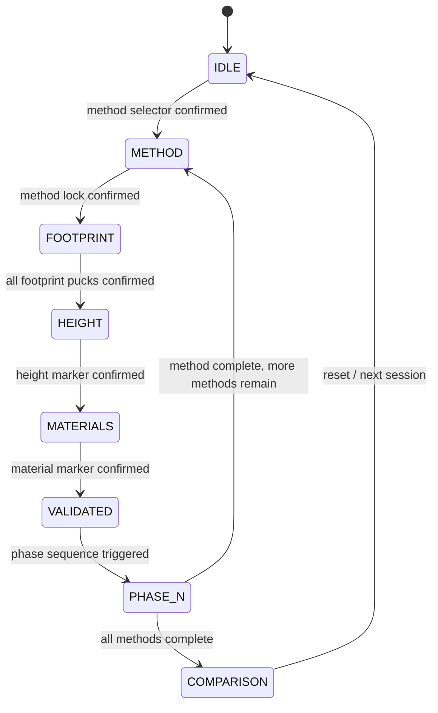

# TouchDesigner FSM Spec

**Project:** Hardware III - Guided Comparative Assembly  
**Prepared:** May 4, 2026  
**Canonical runtime source:** [fsm_full.py](/o:/Hardware_III/touchdesigner/scripts/fsm_full.py)

## 1. Purpose

This document defines the FSM architecture that best matches:
- the locked proposal
- the current roadmap
- the working TouchDesigner implementation

It replaces the earlier draft in which wrapper states and content states were mixed into one flat list.

## 2. Canonical Layered Model

The project uses three different state layers.

### Canonical Content FSM

This is the main visitor-facing interaction sequence and the **canonical FSM**:

```text
IDLE
  ->
METHOD
  ->
FOOTPRINT
  ->
HEIGHT
  ->
MATERIALS
  ->
VALIDATED
  ->
PHASE_N
  ->
COMPARISON
```

`PHASE_N` is one implementation state in TouchDesigner with an internal phase index:
- Phase 1: Foundation
- Phase 2: Structure / Walls
- Phase 3: Roof
- Phase 4: Openings
- Phase 5: Finishing

### System Wrapper States

These are system-level modes that sit around the canonical content FSM:
- `CALIBRATION_CHECK`
- `ERROR`
- `RESET`
- `MANUAL_OVERRIDE`

They are not the visitor’s main content path.
They are support modes for setup, failure recovery, and operator control.

### Visual Feedback States

These are projection feedback states:
- `DISCONNECTED`
- `PENDING`
- `INVALID`
- `VALID`
- `IDLE_ANIM`
- `SUMMARY`
- `COMPARISON`

They are output states, not the canonical content FSM.

## 3. Why This Is The Right Canonical FSM

This FSM is the best canonical choice because it is the only one that is simultaneously:
- locked in the proposal
- reflected in the roadmap
- already implemented in code

The matching references are:
- [PROJECT.md](/o:/Hardware_III/.planning/PROJECT.md)
- [ROADMAP.md](/o:/Hardware_III/.planning/ROADMAP.md)
- [fsm_full.py](/o:/Hardware_III/touchdesigner/scripts/fsm_full.py)

Older state lists such as:
- `GUIDING`
- `CHECKING`
- `NEXT_PIECE`
- `MODEL_COMPLETE`
- `NEXT_MODEL`

should now be treated as **historical proposal-development states**, not the active runtime definition.

## 4. Canonical Content FSM State List

| State | Purpose | Entry condition | Success condition | Next state | Visual feedback usually used |
|---|---|---|---|---|---|
| `IDLE` | Attract mode and waiting state before a method is selected | System is ready and no active method is locked | Method selector puck is confirmed in target | `METHOD` | `IDLE_ANIM` |
| `METHOD` | Locks one construction method for the current run | Method selector puck has engaged the pedestal zone | Selected method puck stays in target long enough | `FOOTPRINT` | `PENDING`, `VALID` |
| `FOOTPRINT` | Collects the 10 footprint pucks in order | Method is locked | All required footprint pucks are confirmed in sequence | `HEIGHT` | `PENDING`, `INVALID`, `VALID` |
| `HEIGHT` | Sets building height / number of floors | Footprint is complete | Height marker is confirmed in target | `MATERIALS` | `PENDING`, `INVALID`, `VALID` |
| `MATERIALS` | Locks the material / material controller choice | Height is complete | Material marker is confirmed in target | `VALIDATED` | `PENDING`, `INVALID`, `VALID` |
| `VALIDATED` | Shows a short summary and confirms the model is ready to expand into phases | Footprint, height, and materials are complete | External phase-start trigger fires | `PHASE_N` | `SUMMARY` |
| `PHASE_N` | Steps through the five locked construction phases for the active method | Validation has passed | All 5 phases have advanced; either next method starts or all methods are done | `METHOD` or `COMPARISON` | `VALID` |
| `COMPARISON` | Final cross-method comparison state | All methods have completed | Session ends or wrapper reset clears | `IDLE` through wrapper logic | `COMPARISON` |

## 5. System Wrapper States

These states or modes sit outside the content FSM.

| Wrapper state | Purpose | When to use it | Notes |
|---|---|---|---|
| `CALIBRATION_CHECK` | Verifies camera, projector, and table alignment | Before a session, after setup changes, after hardware disturbance | Recommended operator-only preflight mode |
| `ERROR` | Handles recoverable faults and invalid conditions | Tracking loss, impossible placement, hardware or data fault | Should not redefine the content sequence |
| `RESET` | Clears current session and returns the table to a known baseline | Operator reset, abandonment, hard fault recovery | Returns the system to `IDLE` |
| `MANUAL_OVERRIDE` | Allows operator rescue during demo | Vision failure, timing issue, emergency skip | Hidden control mode, not visitor-facing |

### Important rule

The content FSM should stay canonical and stable.
Wrapper states should interrupt or surround it, not replace it.

## 6. Visual Feedback States

These are the states used by the projection layer according to the current TD code and error feedback spec.

| Visual state | Meaning | Typical usage |
|---|---|---|
| `DISCONNECTED` | Vision heartbeat is dead or no reliable tracking is available | Show lost tracking condition clearly |
| `PENDING` | The expected puck has not yet been placed correctly | Show target outline, wait state |
| `INVALID` | A puck exists but is outside tolerance or outside the legal zone | Show red halo and ghost correction |
| `VALID` | A puck is inside tolerance and confirming or confirmed | Show green confirmation feedback |
| `IDLE_ANIM` | Content FSM is idle | Low-energy ambient attract animation |
| `SUMMARY` | Content FSM is in `VALIDATED` | Show summary data before entering phases |
| `COMPARISON` | Content FSM is in `COMPARISON` | Show final multi-method comparison |

### Key separation

Example:
- content state = `FOOTPRINT`
- wrapper state = none
- visual state = `INVALID`

This means the visitor is still in the footprint step, but the latest puck placement is wrong.
That is much clearer than inventing a fake combined state like `FOOTPRINT_INVALID`.

## 7. Current Working TouchDesigner Behavior

The current implementation in [fsm_full.py](/o:/Hardware_III/touchdesigner/scripts/fsm_full.py) uses:
- `pucks`
- `vision_alive`
- `manual_advance`
- `advance_to_phase_n`
- `advance_phase`

and writes:
- `fsm_state_name`
- `visual_state`
- `lca_trigger`
- `current_method`

### Content-state transitions already coded

| From | Condition in current code | To |
|---|---|---|
| `IDLE` | Method selector puck is in target and held for `CONFIRM_HOLD_FRAMES` | `METHOD` |
| `METHOD` | Same method puck stays confirmed in pedestal zone | `FOOTPRINT` |
| `FOOTPRINT` | All required footprint pucks are confirmed in order | `HEIGHT` |
| `HEIGHT` | Height marker is confirmed | `MATERIALS` |
| `MATERIALS` | Material marker is confirmed | `VALIDATED` |
| `VALIDATED` | `advance_to_phase_n == true` | `PHASE_N` |
| `PHASE_N` | 5 phases complete and not all methods done | `METHOD` |
| `PHASE_N` | 5 phases complete and all methods done | `COMPARISON` |

## 8. Recommended Transition Logic For Next Iteration

The next iteration should preserve the current content FSM and add cleaner wrapper logic around it.

### Content FSM rules
- IF the next expected puck is detected and `in_target == true` long enough THEN confirm that step
- IF the required set for the current content state is complete THEN advance to the next content state
- IF all methods are complete THEN enter `COMPARISON`

### Wrapper rules
- IF `vision_alive == false` for too long THEN set wrapper `ERROR` and visual `DISCONNECTED`
- IF operator issues reset THEN enter wrapper `RESET` and clear session memory
- IF calibration is invalid before public use THEN enter `CALIBRATION_CHECK`

### Visual rules
- IF puck exists and is outside target THEN `INVALID`
- IF puck exists and is inside target during hold window THEN `VALID`
- IF no puck exists yet for the expected step THEN `PENDING`
- IF content state is `VALIDATED` THEN `SUMMARY`

## 9. Input Contract Summary

### Current live input contract

From [osc_handler.py](/o:/Hardware_III/touchdesigner/scripts/osc_handler.py):

```python
pucks[id] = {
    "projector_xy": (px, py),
    "in_target": bool,
    "last_frame": int,
    "lost": False
}

vision_alive: bool
manual_advance: bool
```

### Target normalized contract

As the project scales, CV should normalize toward:
- `piece_id`
- `piece_type`
- `x`
- `y`
- `rotation`
- `confidence`
- `is_stable`
- `is_inside_zone`
- `zone_id`

but the working TD implementation remains the current source of truth until that expansion is actually merged into code.

## 10. Output Contract Summary

The projection system should read at least:
- `current_content_state`
- `system_wrapper_state`
- `visual_feedback_state`
- `active_piece_id`
- `current_method`
- `current_phase_index`
- metric outputs when visible

## 11. Mermaid Diagram



## 12. Implementation Direction

Continue from the **working FSM** in [fsm_full.py](/o:/Hardware_III/touchdesigner/scripts/fsm_full.py).

Do not replace it with a new flat state list.

Instead:
1. Keep `IDLE -> METHOD -> FOOTPRINT -> HEIGHT -> MATERIALS -> VALIDATED -> PHASE_N -> COMPARISON` as canonical.
2. Add `CALIBRATION_CHECK`, `ERROR`, and `RESET` as wrapper/system states around it.
3. Keep `DISCONNECTED`, `PENDING`, `INVALID`, `VALID`, `IDLE_ANIM`, `SUMMARY`, `COMPARISON` as projection feedback states.
4. Update contracts, role docs, and debug panels to display these three layers separately.
