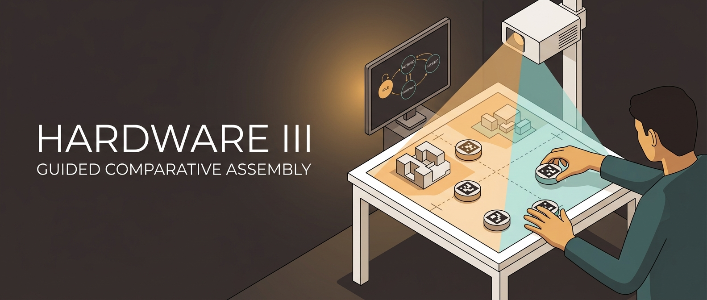

<div align="center">



# 🏗️ Hardware III — Guided Comparative Assembly

**An interactive tabletop installation: visitors physically configure a small building scenario on a marker-tracked table and immediately see the environmental, labor, time, and economic consequences projected back onto the surface.**

[](./LICENSE)
[](https://iaac.net/)
[](https://derivative.ca/)
[](https://www.python.org/)
[](#tech-stack)
[](https://docs.opencv.org/)

**Course:** Hardware III — Human-in-the-Loop: Interactive Systems
**Institute:** [IAAC](https://iaac.net/), MRAC + MAAI 2025 / 2026
**Schedule:** April 10 – May 22, 2026
**Team:** Leo, Elais, Rafik, Seid, Onur, Nithik

</div>

> **👉 Start here:** [`SYSTEM-STATUS.md`](SYSTEM-STATUS.md) — current state of every subsystem, what works, what's blocked, and where each team member plugs in.

---

## Mission

We compare construction methods by letting people physically configure a small building scenario on a table and immediately see the environmental, labor, time, and economic consequences through projection.

## Core Interaction

The visitor selects a construction method, configures the footprint, sets the height, picks the material logic, validates the scenario, moves through five construction phases, and finally reaches a comparison view.

---

## Contents

- [Tech Stack](#tech-stack)
- [Canonical State Model](#canonical-state-model)
- [Quick Start](#quick-start)
- [Repository layout](#repository-layout)
- [Phases](#phases)
- [Source-of-truth order](#source-of-truth-order)
- [License](#license)

---

## Tech Stack

| Tool | Role |
|------|------|
| TouchDesigner 2025.32050 | Primary runtime — FSM, projection, integration |
| Python 3 + OpenCV (ArUco) | Camera-side marker detection, OSC out to TD |
| ESP32 + MFRC522 (RFID) | Method selection, presence, hardware triggers |
| Rhino + Grasshopper | Offline geometry authoring + fabrication only — **not** runtime |
| Overhead USB webcam | ArUco tracking |
| Short-throw projector | Table projection + visual feedback |

The interactive runtime is **TouchDesigner + Python**. Rhino/Grasshopper is used only for designing the physical parts (pucks, models, table mock-up).

---

## Canonical State Model

Layered model — do not collapse into a single flat list:

### Content FSM (visitor-facing)

```text
IDLE → METHOD → FOOTPRINT → HEIGHT → MATERIALS → VALIDATED → PHASE_N → COMPARISON
```

`PHASE_N` is one TouchDesigner state with an internal phase index for the five locked construction phases: Foundation → Structure/Walls → Roof → Openings → Finishing.

### System wrapper states

`CALIBRATION_CHECK`, `ERROR`, `RESET`, `MANUAL_OVERRIDE` — sit around the content FSM for setup, recovery, and operator control.

### Visual feedback codes

`DISCONNECTED`, `PENDING`, `INVALID`, `VALID`, `IDLE_ANIM`, `SUMMARY`, `COMPARISON` — projection feedback colors, not FSM states. Defined in [touchdesigner/ERROR-FEEDBACK-SPEC.md](touchdesigner/ERROR-FEEDBACK-SPEC.md).

Full FSM details: [.planning/FSM_TOUCHDESIGNER_SPEC.md](.planning/FSM_TOUCHDESIGNER_SPEC.md)

---

## Quick Start

### 1. TouchDesigner side

Open `vertical-slice.toe`. Network nodes:

| Node | Type | Role |
|------|------|------|
| `vision_in` | OSC In CHOP | OSC data from CV pipeline |
| `rfid_in` | Constant CHOP (stub) → Serial DAT (real) | construction method selector |
| `compute_state` | Script CHOP | aggregates `puck_count`, `area`, `method_id`, `hb_alive` |
| `render_footprint` | Script TOP | renders 1280×720 projection image |
| `stats_text` | Text TOP | text overlay (Pucks / Area / Status) |
| `compose_final` | Over TOP | merges `render_footprint` + `stats_text` |
| `projector_out` | Window COMP | sends image to projector |

Full setup: [touchdesigner/TD-FRAMEWORK-GUIDE.md](touchdesigner/TD-FRAMEWORK-GUIDE.md)

### 2. Vision pipeline

```bash
pip install opencv-contrib-python python-osc pyyaml numpy

python -m vision.src.run_vertical_slice \
  --camera 0 \
  --intrinsics vision/calibration/synthetic_intrinsics.yml \
  --homography vision/calibration/synthetic_homography.yml
```

Press `Q` to quit. Replace synthetic YAMLs with real calibration files when camera is mounted.

### 3. ESP32 (later, when hardware is built)

See [firmware/esp32-integration/ESP32-SENSOR-SYSTEM.md](firmware/esp32-integration/ESP32-SENSOR-SYSTEM.md) for hardware spec. Until then, `rfid_in` is a Constant CHOP — change Channel 0 Value (0–4) to switch construction methods.

---

## Repository layout

```
README.md                    — this file
CONTRIBUTING.md              — repo conventions
INTERFACE_CONTRACT.md        — system-level data flow between subsystems
vertical-slice.toe           — main TouchDesigner project file

.planning/                   — project plan, FSM spec, roadmap, requirements
archive/                     — historical proposals, FSM drafts, slides (v1, v2)
cad/                         — 3D-printable parts (pucks, models, mounts)
  rhino/                     — Rhino + Grasshopper geometry sources
  aruco-markers/             — generated marker PNGs for printing
data/                        — JSON databases (methods_db.json, etc.)
deliverables/                — submission-ready artifacts
docs/                        — design notes, meeting records, research
  fsm/, meetings/            — internal docs
  research/, research_2/     — literature reviews + per-method research
  Data_Field.odt             — data-field spec (collaborator working doc)
firmware/                    — ESP32 firmware + sensor integration spec
media/                       — heavy reference assets
reference/                   — course syllabus, slides, literature notes
touchdesigner/
  scripts/                   — Python scripts pasted into Script OPs
  TD-FRAMEWORK-GUIDE.md      — step-by-step network build guide
  ERROR-FEEDBACK-SPEC.md     — visual feedback codes
  VERTICAL-SLICE-RUNBOOK.md  — run/test instructions
vision/
  src/                       — Python CV pipeline (ArUco detect, OSC send)
  calibration/               — camera/projector calibration files
```

---

## Phases

| Phase | Goal | Deadline |
|-------|------|----------|
| 1 — Proposal & FSM Foundation | S1 deliverables, lock concept | April 17 ✅ |
| 2 — Data Research & Physical Model Design | Source data, fabricate parts, CV vertical slice | May 4 |
| 3 — FSM Implementation & Assembly Logic | Full TD FSM + piece detection | May 4 |
| 4 — Human-in-the-Loop Assembly & Sound | Guided loop, sound layer | May 11 |
| 5 — Projection Mapping & Comparison View | Calibrated projector, comparison stats | May 18 |
| 6 — Integration, Testing & Finals | Reliable end-to-end demo | May 22 |

Status: [.planning/STATE.md](.planning/STATE.md)

---

## Source-of-truth order

When older documents conflict with current runtime, prefer in this order:

1. [touchdesigner/scripts/](touchdesigner/scripts/) — actual Python in TD
2. [.planning/FSM_TOUCHDESIGNER_SPEC.md](.planning/FSM_TOUCHDESIGNER_SPEC.md) — canonical FSM
3. [INTERFACE_CONTRACT.md](INTERFACE_CONTRACT.md) — subsystem data flow
4. [.planning/PROJECT.md](.planning/PROJECT.md) — project context
5. [.planning/ROADMAP.md](.planning/ROADMAP.md) — phase plan

Anything in `archive/` or older Phase 1 docs may still describe a Grasshopper + Anemone + Firefly approach. That's **proposal history** — the current runtime is TouchDesigner + Python.

---

## License

[MIT](./LICENSE) — fork it, build your own table-based installation, point the CV pipeline at a different fiducial system. The course-specific context (IAAC, methods database) is in `data/methods_db.json` and `reference/` — swap it for your own domain when reusing.
